# Self-driving Car Taxi Service Web Project - Front End

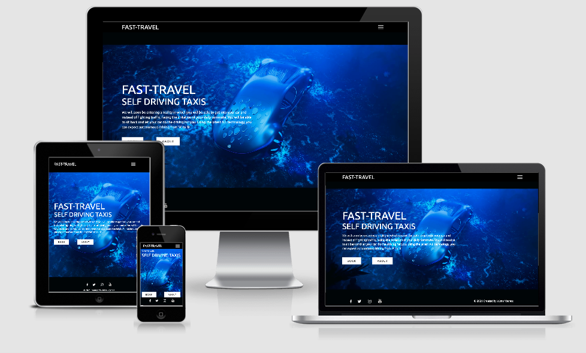

Project Link: https://fast-travel-self-driving.netlify.app/

This project aims to create an interactive front end layout for ordering a self driving car taxi booking service called 'Fast-Travel'. 

The project incorporates a few of Google's API particularly Directions API, Geocoding API, Geolocation API, Maps JavaScript API, Places API. The project also utilises a customer service functionality which will send a summary of the user's order through EmailJS. 

The target audience for this project are its customers/users. It will allow them to order/book a self driving taxi which they can customise via a specification form. Through the numerous forms on the website, they can also choose where their starting point and destination is via the Google Maps API feature on the project. 

## Table of contents

 - [Project Goal](#Project-Goal)
 - [UX](#UX)
 - [User Stories](#User-Stories)
 - [Design](#Design-In-depth)
 - [Features](#Features)
 - [Testing](#Testing)
 - [Technologies](#technologies-used)
 - [Deployment](#deployment)
 - [Credits](#credits)
 - [Known Bugs](#known-bugs)
 - [Design Changes](#design-changes)
 - [Future Implementations](#future-implementations)
 - [Acknowledgements](#acknowledgements)

## UX 

### Strategy 

My strategy for the website is to allow the users to order a self driving taxi via a form. It focuses primarily on functionality and ease of use. The website should process the user's input and acknowledge their specifications. It will give them the route the taxi will take and outline their specification options prior to the trip. Providing them an immersive experience. It will then provide them a booking confirmation.

### Scope 

The website will allow the user to decide the starting point and the destination of their journey where their route is shown on the map. The map is also interactive and will show markers to relevant locations. It will then provide the user with more options via a form so that the customer can personally customize their experience. A summary of the user's order should be provided to them as an email. They will also have the chance to contact customer service through a form.

### Structure 

The website incorporates a multi-page design. The landing page, the Google Maps form, the specifications form and the about page will be separated and have their own dedicated pages. The two form pages will be interactive and connected to each other, one page will ultimately lead to another. They shall also acknowledge any buttons the user presses or any preferences the user chooses.

### Skeleton

These wireframes are the blueprints to the project. These were made to help plan the project and see how the features could be implemented. Design decisions were made during the production of the website that may stray from what the wireframes initially conveyed.

  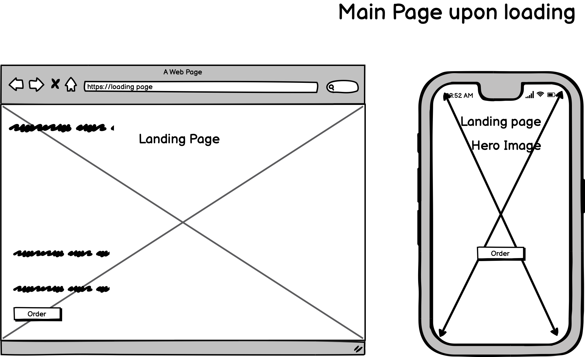

  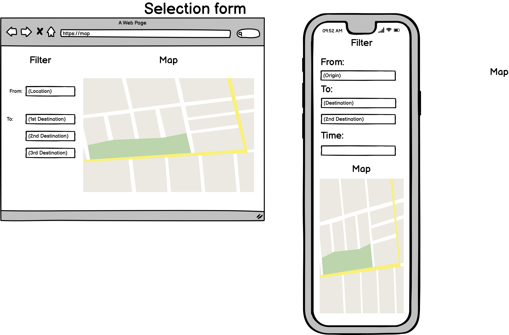

  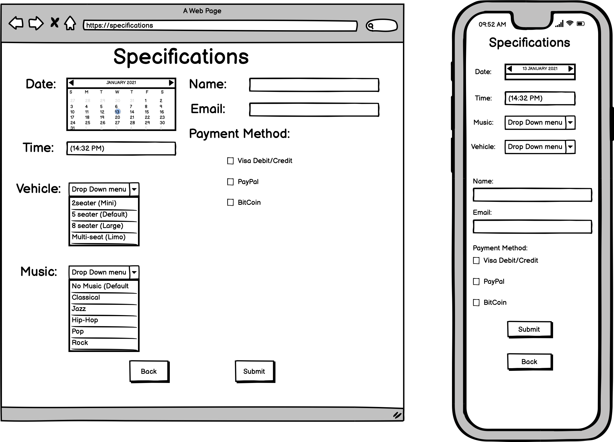 

  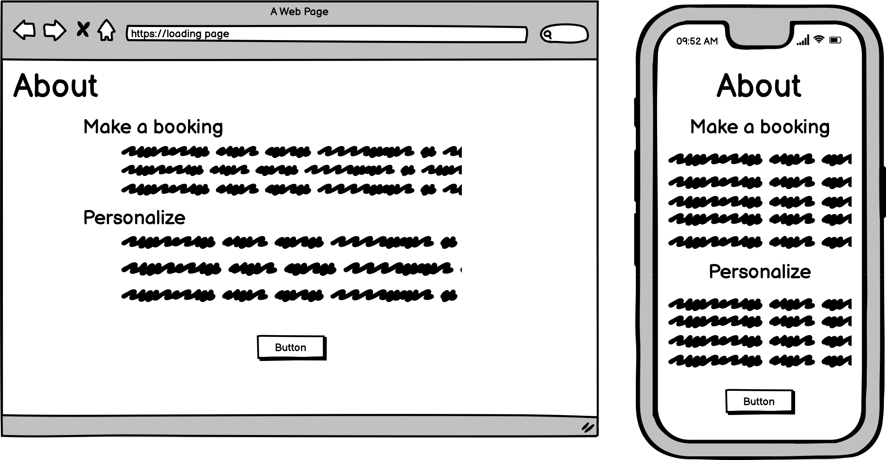

### Surface

The site focuses primarily on functionality rather than design. The design of the website will be simply made yet elegant, focusing on balancing dark and light colors complimented with lightning blue. It uses an mp4 video gif for the landing page. The Maps form page is interactive and will respond when the user interacts with the inputs fields or the map. Their interactions will reflect on the map itself. The specification form page will consist of a simple form and its color scheme will inherit the site's overall theme.

## User Stories:

- ### First Time Visitor Goals:

  <strong>a.</strong> I would like to know the purpose for the creation of the website from the first instance of opening it
  <strong>b.</strong> I would greatly appreciate it if the website were easy to navigate.
  <strong>c.</strong> I expect the website to display relevant content and stay consistently relevant as I explore the site 
  <strong>d.</strong> I would appreciate it if my interactions with the site were acknowledged so that, instictively, I will know what I am doing and where I am going
  <strong>e.</strong> I would like the content to be structured and easy to follow
  <strong>f.</strong> I would like the website to be interactive and to respond according to my interactions

- ### Returning Visitor Goals:
  
  <strong>a.</strong> I would like if the website assisted me by predicting my inputs
  <strong>b.</strong> I would like to see my previous specifications/inputs to be remembered at any time when I explore the website
  <strong>c.</strong> I would like to receive an email summary of what I have ordered 
  <strong>d.</strong> I would like to research the company further 

- ### Frequent Visitor Goals: 
  
  <strong>a.</strong> I would like if the website could tell me where I am during my trip
  <strong>b.</strong> I want to be able to contact the business quickly should I encounter any issues during the journey
  <strong>c.</strong> I want to be able to navigate to any section of the website at any point in time

## Design In-depth

### Colour Scheme 

- The overall project will use the colors:
  
  <strong>(i)</strong> Lightning blue (#38acec) 

  <strong>(ii)</strong> White (#fff) 

  <strong>(iii)</strong> Dark (#000)(Bootstrap version - #161c2d). 

  <strong>(iv)</strong> Red (#ff0000)
 

### Fonts 

- Ubuntu is the font used for the overall project
- Sans serif is the fallback font should the fonts be imported incorrectly

### Opening the website: 

- The website should be consistent and objective. It should communicate the reason as to what the website was created for using the text and video that plays in the background 
  
- There will be two 'call to action' buttons where the user can book a journey straight away or explore more on what the website is supposed to do/how to use it.


### Navigation 

- The navigation menu will always be present as a toggle menu at the top right hand side of the page. 
  
- It will be there to assist the user in traversing to certain parts of the site at any point in time

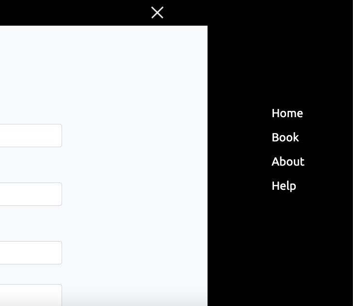

### Booking:

- This section will assist the user with a simple form and a map

- As show in the wireframe this section will have a map and will also request for the origin point and the destination

- Unlike the map wireframe it has changed and will only request for one destination point. It will additionally ask for the date and the time of booking

- Unlike the map wireframes as well, this section of the website will expand to show the Geocode and the booking summary of the user's journey. Additional 'call to action' buttons have also been implemented
  
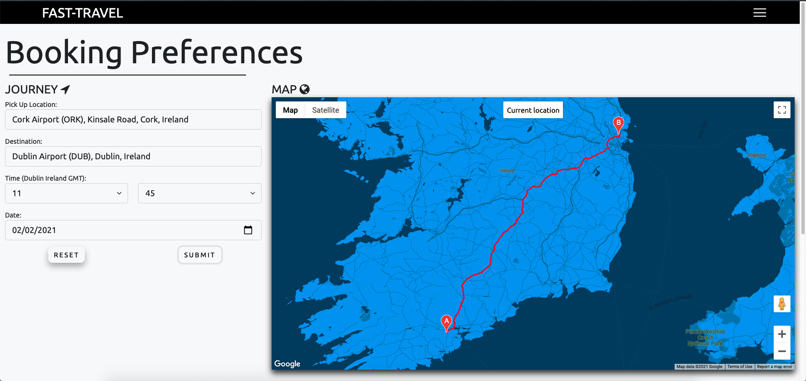
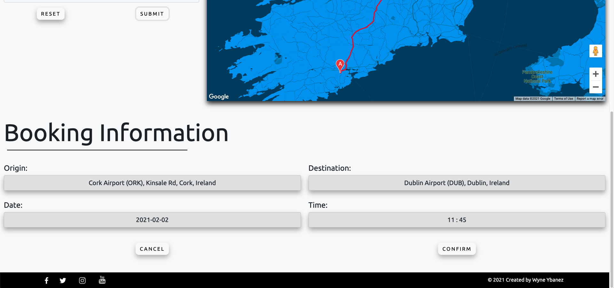

### Specifications form:

- Once the user has confirmed the details of their journey. They can then personalize the trip to their liking
  
- The Specifications form has changed from what is displayed on the wireframes

- The Date and Time of the journey is no longer requested on this page but has moved to the booking form in maps.html

- Still requests for name, email, payment method, vehicle and music choice

- Page height is reactive and will expand once the required inputs have been entered with an additional 'call to action' button for an email confirmation to be sent to the user

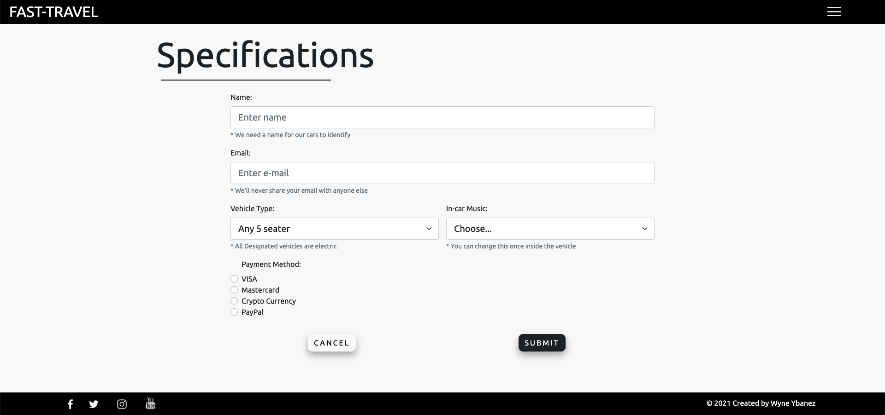
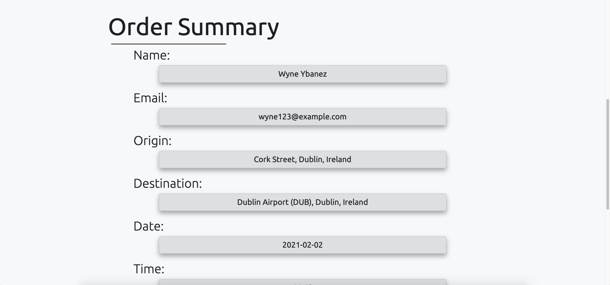

### Customer Service: 

- It would be efficient if there was a way for users to contact the business should they encounter any issues during their trip

- This feature will require the user to input their contact details and order ID via a contact form 

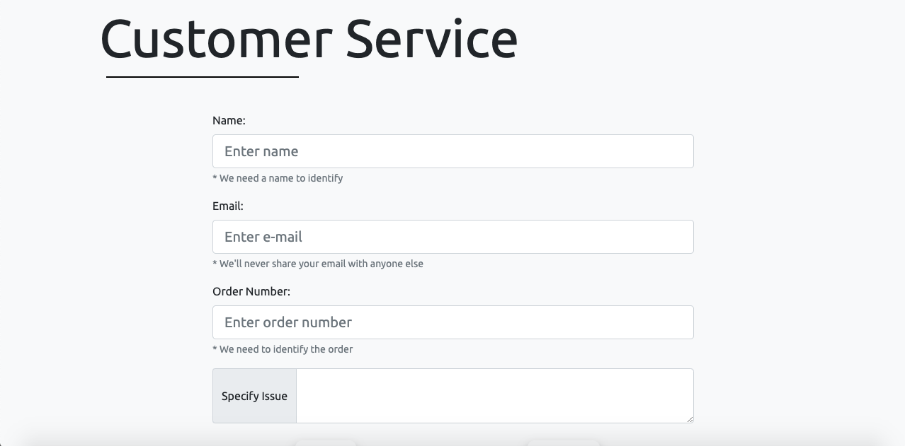

### Footer:
  
- There is no dedicated footer links for the website 
  
- Rather, the site will focus primarily on functionality. Should the user wish to learn more about the business, they can click on the social links at the bottom of the page 

## Features

### Responsive: 

  The website should be responsive and confirm all interactions. 

  There should be some sort of indicator or animation that can confirm whenever the user is hovering over a button or clicking on it when using a computer or desktop.

  The inputs the user enters should saved and displayed accordingly when necessary.

  It should shrink windows and align items correctly when the user is minimizing the window or using a mobile phone. The website should be responsive when viewed on modern devices.

  The website should function accordingly in modern web browsers.

  The website will provide alert windows which informs the user of waiting times or of events that will be ocurring. 

  Responsiveness will be following the guidelines of the devices shown in [AMI responsive](http://ami.responsivedesign.is/)

### Interactive: 

  The user should be able to interact with the website and function according to the given text
  i.e. Clicking on 'Email COnfirmation' should send an automated message to the designated email address.

  Fade animations should be present on accordingly as the user enters or traverses down the page.

  The page will display the appropriate information as stored in the API's used and/or display the inputs the user has typed into the forms.
  
### Convenience: 

  The user should be able to navigate the website easily, at any point in time.
  
  The content of the website should stay relevant and appropriate. 

  The buttons leading to separate pages should appear in good time in preparation for the user's desire to proceed with any request.

  All features/functionalities should be clear and presented without any distractions. Ideally, it should be easy for the user to understand and use the website.

## Testing 
  
I have added the testing onto a separate .md file - here is the [link](TESTING.md)

## Technologies used:

### Languages

-  [HTML5](https://en.wikipedia.org/wiki/HTML5)
-  [CSS3](https://en.wikipedia.org/wiki/Cascading_Style_Sheets)
-  [JavaScript](https://en.wikipedia.org/wiki/JavaScript)
  
### IDE

- [VScode:](https://code.visualstudio.com/) - The IDE used to code the website. 
- VSCode extension: [LiveServer](https://marketplace.visualstudio.com/items?itemName=ritwickdey.LiveServer)
- VSCode extension: [Prettier - Code Formatter](https://marketplace.visualstudio.com/items?itemName=esbenp.prettier-vscode)

### Frameworks, Libraries, CDN's, Resources etc.

1. [AOS](https://michalsnik.github.io/aos/) 
    - This JS library was used for the animations on scroll.
2. [Bootstrap v5.0](https://getbootstrap.com/docs/5.0/getting-started/introduction/) 
    - Bootstrap was used for the overall components documentation and responsiveness of the website.
3. [Balsamiq](https://balsamiq.com/)
    - Balsamiq was used to create the wireframes during the design process.
4. [GitHub](https://github.com/)
    - GitHub is used to store the projects code after being pushed from Git.
5. [Git](https://git-scm.com/)
    - Git was used for version control by utilizing the Gitpod terminal to commit to Git and Push to GitHub.
6. [Font Awesome](https://fontawesome.com/)
    - Font Awesome was used on all pages throughout the website to add icons for aesthetic and UX purposes.
7. [Google Fonts](https://fonts.google.com/)
    - Google fonts were used to import 'Roboto' and 'Montserrat' as the chosen styled fonts for the site.
8. [Google Maps JavaScript API](https://developers.google.com/maps/documentation/javascript/overview)
    - Documentation used for creating interactive map, markers and info-window on maps.html.
9. [Google Geocode API](https://developers.google.com/maps/documentation/geocoding/start?utm_source=google&utm_medium=cpc&utm_campaign=FY18-Q2-global-demandgen-paidsearchonnetworkhouseads-cs-maps_contactsal_saf&utm_content=text-ad-none-none-DEV_c-CRE_397052992475-ADGP_Hybrid%20%7C%20AW%20SEM%20%7C%20SKWS%20~%20Places%20%7C%20BMM%20%7C%20Geocoding%20API-KWID_43700049595992151-aud-903284319980%3Akwd-301485308042-userloc_1007835&utm_term=KW_%2Bgeocoding%20%2Bapi-ST_%2Bgeocoding%20%2Bapi&gclid=CjwKCAiAjeSABhAPEiwAqfxURaMpqReVWiqrv3HLN6eRCg3t4R8M_VXfnVzKOwrrdQ5tRIzP3Azj7BoC2hAQAvD_BwE)
    - Used to display booking summary within maps.html.
10. [Google Directions API](https://developers.google.com/maps/documentation/directions/overview)
    - Used to display route on map once pick-up location and destination has been determined.
11. [Chrome Developer Tools](https://developers.google.com/web/tools/chrome-devtools)
    - Used to debug and style with css for the whole project.
    - Used for media queries.
12. [Ami Responsive](http://ami.responsivedesign.is/#)
    - Used to test for website responsiveness and media query establishment.
13. [Snazzy Maps](https://snazzymaps.com/style/132/light-gray)
    - Used to style the map and give it the light grey futuristic look.
14. [Axios](https://github.com/axios/axios)
    - To get Data and display it on page from Google's Geocode API via promises.
15. [EmailJS](https://www.emailjs.com/)
    - Automated confirmation emails sent to user's once they've submitted their inputs.
16. [Jasmine Framework](https://jasmine.github.io/)
    - Used to test for the general functionality of the Booking process
  
## Deployment

### Github

1. Log into Github and Locate the relevant repository. Here is a [link](https://github.com/wyne-ybanez/self-driving-car-delivery)  
2. Click on the settings buttons on the horizontal menu
3. Scrolling down until you reach "Github pages" 
4. There is a heading named "Source". There is a button underneath it. Click on that button and change it from "none" to "main". Then click "save"
5. You will have to scroll down to the heading "Github Pages". The published [site](https://wyne-ybanez.github.io/self-driving-car-delivery/) with the link should be there.   

### Forking the Repository

You can fork the repository through the following steps. Forking the repository means you will have a copy of the repository and any changes you make will not affect the original repository.

1. Log in to GitHub and locate the GitHub Repository. Here is a link for the [repository](https://github.com/wyne-ybanez/self-driving-car-delivery)
2. At the top of the Repository (not top of page) just above the "Settings" Button on the menu. Looking towards the right of the page. Locate the button "Fork" then click 
3. You should now have a copy of the original repository in your GitHub account

### Local Clone

This is used when you would like to make changes to the project code

1. Should you wish to use a different IDE like VSCode. You first log in to Github and locate the required repository. Here is the link for this [repository](https://github.com/wyne-ybanez/self-driving-car-delivery)
2. Open a new terminal on Git Bash
3. Type `git clone`, and then paste the URL you copied 

```
$ git clone https://github.com/wyne-ybanez/self-driving-car-delivery
```

 Here is a link that can explain this process further. [Click Here](https://help.github.com/en/github/creating-cloning-and-archiving-repositories/cloning-a-repository#cloning-a-repository-to-github-desktop)

## Credits

### Code 

- Animate on Scroll used throughout the entire website. Check it out [here](https://michalsnik.github.io/aos/)

- Google Maps template used for styling from Snazzy Maps. Here is the [link](https://snazzymaps.com/style/47631/blue)
   
- Brad Traversy code used and editted for landing page video, navigation menu toggle, overall index.html styling and social icon hover [animation](https://codepen.io/bradtraversy/pen/eYdMqvx)

- Ben Hasselgren's styling used for maps.html inputs, map and project [inspiration](https://benhasselgren.github.io/ifd-milestone-project-pages/)

- Documentation for Bootstrap [Contact Form](https://getbootstrap.com/docs/5.0/forms/validation/) 

- Solution for simple calendar functionality on date [input field](https://developer.mozilla.org/en-US/docs/Web/HTML/Element/input/date)

- Underlining the Heading with adjustable border - this is the [solution](https://www.steckinsights.com/shorten-length-border-bottom-pure-css/)
  
- CodeFlix's solution for route between two [points](https://www.dropbox.com/s/8yq58seg4zp902q/test.html?dl=0)

- StackOverFlow solution for changing route [color](https://stackoverflow.com/questions/19022702/how-to-change-the-color-of-route-in-google-maps-v3)

- Google Maps predictive text [autocompletion](https://developers.google.com/maps/documentation/javascript/examples/places-autocomplete)

- Google Maps documentation for getting the user's current location by geolocating their [device](https://developers.google.com/maps/documentation/javascript/examples/places-autocomplete)

- Brad Traversy code for location geocoding implemented to show booking [summary](https://www.youtube.com/watch?v=pRiQeo17u6c&t=917s&ab_channel=TraversyMedia)

- Dcode Local storage tutorial used to access local storage data and display it for order summary in Specifications [page](https://www.youtube.com/watch?v=k8yJCeuP6I8&ab_channel=dcode)

- Dcode Loading Gif image code used for all loading screen in all pages 

- Generate random order code to provide bookings with unique order ID's - here is the [link](https://www.drzon.net/posts/generate-random-order-number/)

- AMI responsive screen devices used for specifying max/min width of media [queries](http://ami.responsivedesign.is/)

- Theodore Anderson's Jasmine tutorial which helped me understand how to use the framework effectively - [link](https://www.youtube.com/watch?v=dFz2h7o0vqs&ab_channel=TheodoreAnderson)
  
### Content

- Etoro's article about self-driving cars was used and editted within [index.html](https://www.etoro.com/news-and-analysis/market-insights/self-driving-cars-the-biggest-development-in-transportation-since-the-automobile/?gclid=CjwKCAiAxp-ABhALEiwAXm6IyVNlUeSKc-wQishBJWyBlx6SzvMlAnk9Cw8rV1YNpAZerLKV-LfI2hoCmYsQAvD_BwE)

### Media 

- AVTR youtube video which was used for landing [page](https://www.youtube.com/watch?v=l5ZK0S8Q7JU&ab_channel=Mercedes-Benz)

- Loading Gif obtained from [icons8](https://icons8.com/preloaders/)
  
## Known Bugs

- After following Google Docs for the pan and zoom effect on the markers. Clicking on the markers did not cause the event to happen. ie. Pressing on 'A' or 'B' shows the address through an info window however, the map will not pan or zoom to the markers once the route has been established. It will only do so if the markers are out of sight

- When viewed on the Macbook Pro Mid 2012 - 13", the laptop media queries as specifed on [ami responsive](http://ami.responsivedesign.is/#) were not applying the styling correctly when tested on a physical device. Although when checked on the website, the intended styling is present. This has now been changed but may still affect other devices.
  
- Bug where a route will display even when it's not on the same country. Route display seems like it will not stay to the specified region:
  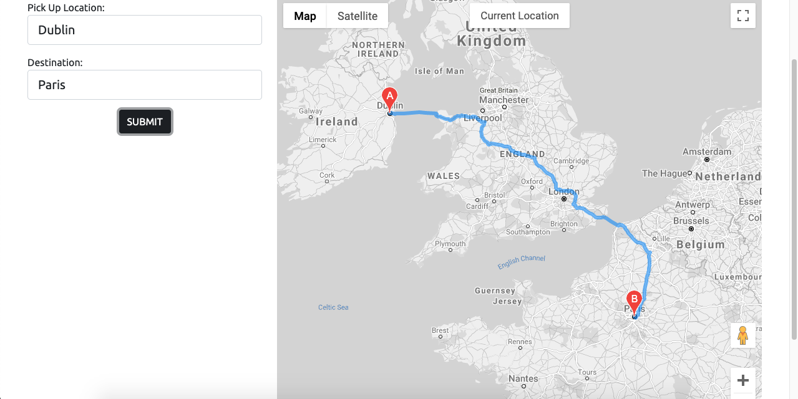

- Github pages may refrain index.html background video from playing and will show a dark background instead.

## Design Changes 

- The website used to incorporate a dark background, this has been changed to a light background. Dark Text color has been assigned to contrast this accordingly.

- Previously, the website was supposed to input several destinations and set way point this these other destinations before reaching the final location. This was specified in the wireframes, this has been altered so that vehicle only travels between 2 locations. 
  
- The Specifications page has also changed from what the wireframes initially displayed. It no longer asks for the date and time of the trip.

- There is now a dedicated help/customer service page which will assist the customer with any issues they may encounter during their trip.

## Future Implementations 

- I would like to style further media queries for the website.

- I would like to add a dedicated back end processing to save previous customer interactions and use that data to 
  predict the customer's future requests, send them the appropriate vehicles, save any useful data that can make the booking process quicker.
  
- To allow user's to log in and set up personal accounts.
  
- To refine maps.html and make it simpler or more convenient to use.

- I would like for the social links to lead to a dedicated social media accounts for the website.
  
- I would like to implement a chat bot to assist the user's on any query during their travel.

- Test the website programming more thoroughly.

## Acknowledgements

- I received Inspiration for the Maps section and the predicitve input fields from Ben Hasselgren's Holiday Planner [Project](https://benhasselgren.github.io/ifd-milestone-project-pages/#)

- My Mentor Dick Vlaanderen for his continuous feedback

- Tutors at Code Institute for their on-going support
  
- Code Institute's EmailJS lesson which inspired me to send confirmation emails after user form sumbissions
  
- Code Institute's Slack community which provided me with ideas as to how to approach the project


